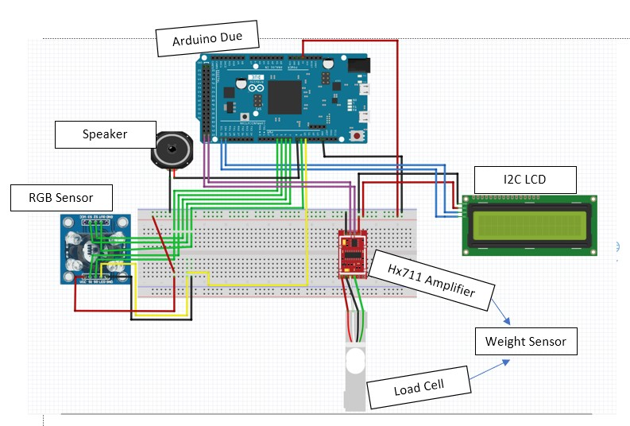

# Object and Property Identifier using Arduino Due
## Motivation
    Wanted to create a system that would assist visually impaired individuals with:
        - Identifying specific objects 
        - Identifying specific properties of objects
    The solution?   
        - A Multi-Purpose System geared towards aiding individuals with visual impairments
    System uses:
        - 2 sensors to retrieve data 
        - 2 actuators to output the properties and object names

## Diagram and Schematic

## Functionality 
The OP-Identifier uses 2 sensors and 2 actuators to identify both the category/name and properties of an object.

Using the color sensor, it detects different light intensities, which in turn allows for the detection of certain colors
The Weight sensor, which is made of a load cell and hx711 amplifier, detects deformations. Using a strain to voltage proportionality, the weight of an object can be accurately measured, through the assistance of the hx711 amplifier.

The functionality of the speaker is to output morse code for the color/category/name of an object.
The LCD is used to display the weight/color/category/name of an object.

Link to full report: https://github.com/laxitshahi/OP-Identifier/blob/main/pdf/Laxit-Shahi-Final-Report.pdf

## References
- A. Newton, “RGB Color Detector using TCS3200 Color Sensor 
Arduino,” How To Electronics, 27-Feb-2021. [Online]. Available:
https://how2electronics.com/rgb-color-detector-tcs3200-color-sensorarduino/. [Accessed: 29-Apr-2021].

- D. Nedelkovski , “Arduino Color Sensing Tutorial - TCS230
TCS3200 Color Sensor,” HowToMechatronics, 05-Feb-2021.
[Online]. Available:
https://howtomechatronics.com/tutorials/arduino/arduino-colorsensing-tutorial-tcs230-tcs3200-color-sensor/. [Accessed: 29-Apr2021].

- Fmalpartida, “fmalpartida/New-LiquidCrystal,” GitHub, 2020.
[Online]. Available: https://github.com/fmalpartida/NewLiquidCrystal. [Accessed: 29-Apr-2021].

- I. Luuk, “4-Wire Load Cell (1/5/10/20/200kg) with HX711 and
Arduino,” 4-Wire Load Cell (1/5/10/20/200kg) with HX711 and
Arduino - Circuit Journal, 15-Jun-2020. [Online]. Available:
https://circuitjournal.com/four-wire-load-cell-with-HX711.
[Accessed: 29-Apr-2021].

- Mantoui, “Arduino Due and tone(),” Arduino Forum, 11-Dec-2012.
[Online]. Available: https://forum.arduino.cc/t/arduino-due-andtone/133302/3. [Accessed: 29-Apr-2021].

- M. Schoeffler, “Arduino Tutorial: HX711 Load Cell Amplifier
(Weight Sensor Module) + LCM1602 IIC V1 LCD,” Michael
Schoeffler, 06-Jan-2021. [Online]. Available:
https://mschoeffler.com/2017/12/04/arduino-tutorial-hx711-load-cellamplifier-weight-sensor-module-lcm1602-iic-v1-lcd/. [Accessed: 29-
Apr-2021].

- O. Kallhovd, “HX711_ADC,” GitHub, 20-Feb-2021. [Online].
Available: https://github.com/olkal/HX711_ADC. [Accessed: 29-
Apr-2021]. 
